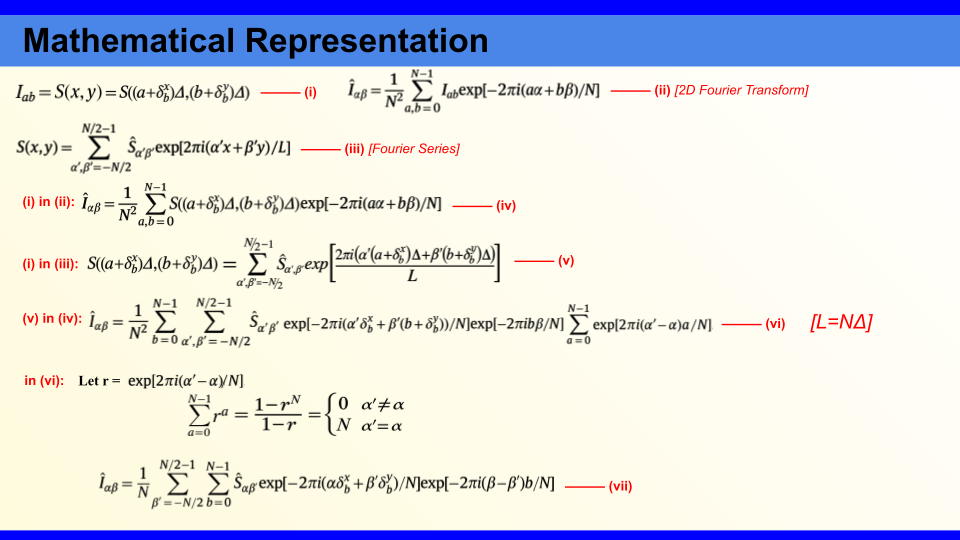
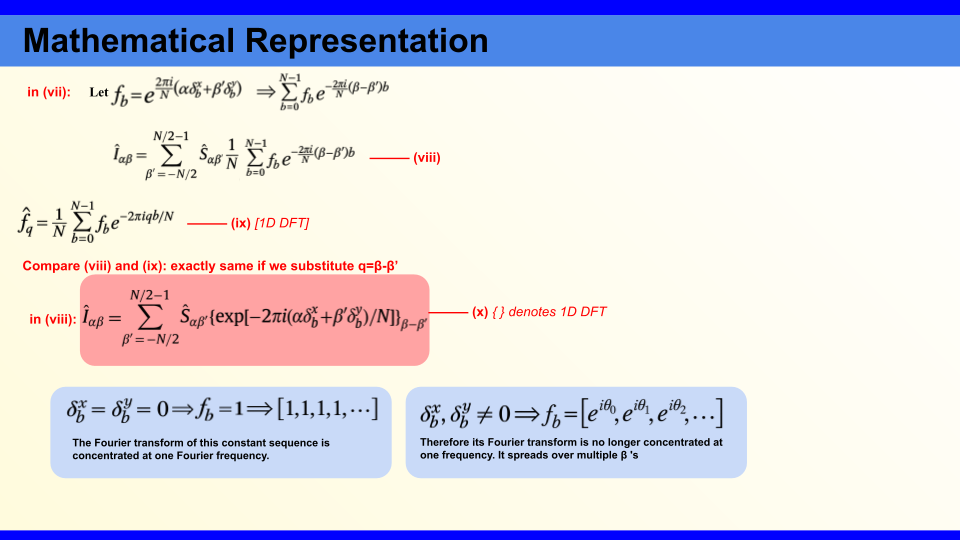

Mechanical vibrations and instabilities during scanning transmission electron microscopy (STEM) can introduce distortions into the final image. Although these distortions may be difficult to notice by eye, they can significantly affect quantitative analyses such as strain mapping. It is therefore important to quantify and correct them.

In Systematic image distortion correction in scanning transmission electron microscopy, Braidy et al. showed that scan-induced distortions leave a characteristic signature in Fourier space: Bragg spots become smeared into streaks. They then developed a mathematical framework to understand this effect and extract the distortion from these streaks.

<figure>
  
</figure>

The derivation starts by describing the distortion of each scan row using two displacement terms, $\delta_b^x$ and $\delta_b^y$. After expressing the ideal image as a Fourier series and taking its 2D Fourier transform, the effect of these displacements appears as a row-dependent phase factor:

$$
f_b=\exp\left[-2\pi i\frac{\alpha\delta_b^x+\beta'\delta_b^y}{N}\right]
$$

<figure>
  
</figure>

As shown in the equation (x), if there is no distortion, this factor is simply: 
[1,1,1,...]
whose Fourier transform is concentrated at a single frequency. When the displacement varies from row to row, the sequence becomes:

$$
[e^{i\theta_0},e^{i\theta_1},e^{i\theta_2},\ldots]
$$

and its Fourier transform spreads across multiple $\beta$ frequencies. This spreading is what appears as a streak around the Bragg spot.

The important part is that the streak also contains information about the displacement. By isolating a streak and taking its inverse Fourier transform, its phase can be related to the row displacement. Using two non-collinear Bragg spots gives two independent equations, allowing the horizontal and vertical displacement components to be recovered. Thus, the method essentially turns an unwanted Fourier-space artifact into a way of measuring and correcting the distortion introduced during STEM scanning.

I’ll discuss the paper and its methodology in more detail as I develop a better understanding of it and begin implementing it myself.

Thankyou for reading!

